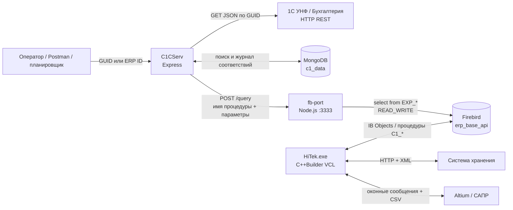

# C1CServ и HiTek: контекст приложения для LLM

Актуальность исследования: **2026-08-06**, часовой пояс Asia/Yekaterinburg. Документ составлен по текущим исходникам `C:\NodeProjects\C1CServ`, исходникам HiTek `C:\RADProjects\HiTek12_indukchiy` и read-only запросам к живой базе `firebird5.home.lan/3050:erp_base_api`. Firebird сообщил версию **6.0.0** и путь `/var/lib/firebird/erp_base_api.fdb`. Пароли, токены и персональные данные намеренно не приводятся.

## 1. Краткое назначение

`C1CServ` — интеграционный HTTP-сервис на Node.js/TypeScript. Его основная задача — получить по GUID объект из REST-сервиса 1С, преобразовать JSON в параметры хранимых процедур HiTek, записать объект в Firebird через отдельный шлюз `fb-port` и сохранить соответствие `GUID 1С ↔ ID HiTek` в MongoDB.

Основное направление обмена — **1С → C1CServ → fb-port → Firebird/HiTek**. Частично реализовано направление **HiTek → 1С** только для номенклатуры. Десктопное приложение HiTek не вызывает C1CServ: оно напрямую читает уже загруженные данные из Firebird.

Каталог `build/` — скомпилированная JavaScript-копия `src/`, а не самостоятельный модуль. Источником истины является `src/`; `build/` пересоздаётся командой `yarn build`.

## 2. Архитектура и границы компонентов



| Компонент | Роль | Актуальная точка подключения |
|---|---|---|
| `C1CServ` | Оркестрация обмена, маппинг, рекурсия, HTTP API | `.env`: `127.0.0.1:3738`; резерв в коде: порт `3737` |
| Веб-сервис 1С | Источник заказов, справочников, спецификаций и остатков; приём новой номенклатуры | `192.168.10.58:80` |
| `fb-port` | Универсальный HTTP-шлюз к процедурам Firebird | `firebird5.home.lan:3333` |
| Firebird | Основная БД ERP/HiTek и место исполнения бизнес-логики | `firebird5.home.lan:3050`, база `erp_base_api` |
| MongoDB | Журнал исходных JSON и соответствий GUID/`ref_id` | LXC-контейнер 104 `mongo` на Proxmox-хосте `medusa`: `192.168.7.104:27017`, база `c1_data`; MongoDB 4.4. В `.env` C1CServ остался устаревший адрес `192.168.7.222` — он недоступен |
| `HiTek.exe` | Десктопная ERP/производственная система | C++Builder VCL, основная сборка Win32 |

Переменные `DB_NAME`, `DB_USER`, `DB_PASSWORD` присутствуют в `.env` C1CServ, но текущий код C1CServ их не использует: Firebird-доступом владеет `fb-port`.

## 3. Модули C1CServ

| Файл/каталог | Ответственность |
|---|---|
| `src/server.ts` | Загрузка `.env`, запуск HTTP-сервера, обработка сигналов завершения |
| `src/app.ts` | Создание Express, `express.json()`, подключение маршрутов |
| `src/modules/routes.ts` | Все публичные HTTP-маршруты и пакетная обработка массивов |
| `src/modules/validateRequest.ts` | Компиляция JSON Schema через AJV и ответ `400` при неверном теле |
| `src/types/schemas.ts` | Схемы тел `DOC`, `NOM`, `REF_ID`, `objectName/ref_id` |
| `src/types/ExportSchemes.ts` | Главная декларативная карта: путь 1С, коллекция MongoDB, процедура Firebird, поля и вложенные сущности |
| `src/modules/1cdata.ts` | Центральный алгоритм `getObjectC1()`: антидубль, загрузка из 1С, рекурсия, запись ERP/MongoDB |
| `src/modules/fbquery.ts` | Формирование параметров и вызов `http://DB_HOST:DB_PORT/query` |
| `src/modules/db.ts` | Подключение к MongoDB и операции коллекции |
| `src/modules/fromERP.ts` | Незавершённый обратный поток ERP → 1С для номенклатуры |
| `src/modules/parseNomenklature.ts` | Разбор названий чип-конденсаторов/резисторов в `obj_name`, `params`, `values` |
| `src/modules/objHelper.ts` | Чтение значения по пути вида `response.Номенклатура.GUID...` |
| `src/controllers/c1_zc.route.ts` | Фабрика Mongo-коллекций; `allC1_ZC()` существует, но к маршруту не подключена |
| `src/testData/` | Ручные данные и примеры, не автоматические тесты |

Проект использует ESM (`"type": "module"`) и NodeNext. Поэтому относительные импорты в `.ts` намеренно заканчиваются на `.js`.

## 4. Центральный алгоритм импорта

`getObjectC1(scheme, uid, sync_id?, inObj?)` выполняет следующие действия:

1. Создаёт результат `{Collection, uid, _id, ref_id, inserting, finding, prmSQLiu, err}`.
2. Ищет GUID в MongoDB по `scheme.queryField`. Если найден `res.ref_id`, возвращает его без повторного импорта.
3. Если передан GUID, делает `GET http://C1_WEBSERVER/<servC1Path>/<uid>`; для вложенной строки использует уже переданный `inObj`.
4. Добавляет в объект `GUID`, `SYNC_ID`; для номенклатуры формирует `ADD` из регулярных выражений.
5. `getPrmSQLType()` читает поля по `prmMap`, обрезает строки до `len`. Если поле ссылается на другую схему, рекурсивно импортирует связанную сущность и подставляет её `ref_id`.
6. `db_query()` отправляет в `fb-port` `{procedureName, transactonType: "READ_WRITE", prm}`. Процедура возвращает `RES_ID` и `RES_STR`.
7. Элементы `arrMap` получают `PARENT_ID` и импортируются рекурсивно как строки заказа, состав или операции спецификации.
8. Исходный JSON сохраняется в MongoDB вместе с `res.insert_at` и `res.ref_id`.

Коды в поле `err`: `10` — процедура вернула `-1`; `20` — ошибка вставки MongoDB; `30` — ветка обновления MongoDB не реализована; `40` — пойманное исключение. Эти ошибки часто возвращаются внутри HTTP `201`, а не как HTTP `5xx`.

## 5. Публичный HTTP API

| Маршрут | Тело | Фактическое действие |
|---|---|---|
| `GET /` | — | Проверка процесса, `{"message":"Hello World!!!"}` |
| `GET /test_db` | — | Вызов `SYS$GET_DB_INFO` через `fb-port` |
| `POST /C1_ZC` | `{"DOC":["GUID"]}` | Импорт заказа клиента и его строк; создаёт в HiTek документ операции 7 |
| `POST /C1_Partner` | `DOC: string[]` | Импорт контрагентов |
| `POST /C1_Catalog` | `DOC: string[]` | Импорт иерархии групп номенклатуры |
| `POST /C1_City`, `/C1_Country` | `DOC: string[]` | Импорт адресных справочников |
| `POST /C1_Storage`, `/C1_Measure` | `DOC: string[]` | Импорт участков/складов и единиц измерения |
| `POST /C1_Nomenklature` | `DOC: string[]` | Импорт номенклатуры, параметров и последующее получение остатков |
| `POST /C1_Specification` | `DOC: string[]` | Импорт шапки, состава и операций спецификации |
| `POST /C1_nomenclature_cnt` | `DOC: string[]` | Получение остатков из 1С и доведение количества в HiTek вверх |
| `POST /C1_set_nom_cnt_by_nom_id` | `{"NOM":[123]}` | То же по ERP ID через GUID, сохранённый в MongoDB |
| `POST /C1_GUID` | `{"objectName":"Nom","ref_id":123}` | Поиск GUID в MongoDB; поддержаны `Nom`, `Kontragent`, `Storage`, `Measure`, `City`, `Country`, `ZakazClienta`, `Catalog` |
| `POST /ERP_NEW_NOM` | `{"REF_ID":[123]}` | Частичная попытка создать номенклатуру в 1С из ERP |
| `POST /ERP_NEW_CATALOG` | `REF_ID: integer[]` | Только ищет существующий GUID каталога; создание не реализовано |
| `POST /C1_upd_nom_by_nom_id` | `REF_ID: integer[]` | Повторно читает номенклатуру 1С и вызывает `EXP_NOM_IU` с ERP ID |
| `POST /C1_ZC_FILE` | — | Читает список GUID из захардкоженного Linux-пути и импортирует заказы |

AJV требует правильный тип обязательного поля и запрещает дополнительные свойства. Не проверяются UUID-формат, минимальная длина массива, диапазон ID и enum для `objectName`. Ответы не валидируются схемой.

## 6. Карта сущностей 1С → Firebird

| Сущность | Сервис 1С | Процедура Firebird | Основные таблицы |
|---|---|---|---|
| Единица измерения | `unf/hs/ht/get_measure` | `EXP_MEASURE_IU` | `GLB_MEASURE` |
| Город | `unf/hs/ht/get_city` | `EXP_CITY_IU` | `STR_CITY` |
| Страна | `unf/hs/ht/get_country` | `EXP_COUNTRY_IU` | `STR_COUNTRY` |
| Склад/подразделение | `unf/hs/ht/get_organizational_unit` | `EXP_STORAGE_IU` | `STR_STORAGE` |
| Контрагент | `unf/hs/ht/get_partner` | `EXP_FIRM_IU` | `STR_FIRM` |
| Группа каталога | `unf/hs/ht/get_nomenclature_group` | `EXP_CATALOG_IU` | `OBJ_CATALOG`, `OBJ_CATALOG_GROUP` |
| Номенклатура | `unf/hs/ht/get_nomenclature` | `EXP_NOM_IU` | `C1_NOM`, `C1_LINKS`, `OBJ_LIST`, `NOM_LIST` |
| Остаток | `unf/hs/ht/get_quantity_nomenclature` | `EXP_ID_TO_RES_ID`, затем `EXP_NOM_CNT_SET` | `DOC_HEADER`, `DOC_ITEMS`, `NOM_PACK` |
| Спецификация | `unf/hs/ht/get_specification` | `EXP_BOM_LIST_IU` | `BOM_LIST` |
| Состав спецификации | вложенный JSON | `EXP_BOM_ITEMS_IU` | `BOM_ITEMS` |
| Операции спецификации | вложенный JSON | `EXP_BOM_RT_ITEMS_IU` | `RT_ROUTE_ITEMS` |
| Заказ клиента | `unf/hs/ht/get_order` | `EXP_ZAKAZ_IU` | `C1_ZAKAZ_H`, `C1_ZTOD`, `DOC_HEADER` |
| Строка заказа | вложенный JSON | `EXP_ZAKAZ_ITEMS_IU` | `C1_ZAKAZ_I`, `C1_ZAKAZ_NOM_I`, `DOC_ITEMS` |

Все перечисленные процедуры найдены в живой базе, имеют валидный BLR и возвращают как минимум `RES_ID`, `RES_STR`. Значимые сигнатуры:

- `EXP_NOM_IU(ID, NAME_IZD, KOD_IZD, ART_IZD, BARCODE_IZD, MEASURE_ID, CATALOG_ID, OBJ_LIST_NAME, ATRR_LIST, VAL_LIST)`;
- `EXP_NOM_CNT_SET(NOM_ID, PACK_NAME, STR_ID, CNT_NEW, RES_NEW, PRICE_NEW)`;
- `EXP_BOM_LIST_IU(ID, NOM_ID, DESCRIPT, STR_ID)`;
- `EXP_BOM_ITEMS_IU(ID, PID, NOM_ID, CNT, DESCRIPT, ORD)`;
- `EXP_BOM_RT_ITEMS_IU(ID, PID, OPER_NUM, DESCRIPT, OPER_TIME)`;
- `EXP_ZAKAZ_IU(ID, FIRM_ID, NUM_Z, DATA_Z, SROK_Z)`;
- `EXP_ZAKAZ_ITEMS_IU(ID_ZAKAZ, NOM_ID, MEASURE_ID, CNT, CNTW)`.

## 7. Модель данных Firebird

Ключевые связи:

```text
C1_ZAKAZ_H --< C1_ZAKAZ_I --< C1_ZAKAZ_NOM_I >-- NOM_LIST
     |
     +-- C1_ZTOD --> DOC_HEADER --< DOC_ITEMS --> NOM_PACK

NOM_LIST --> OBJ_LIST --> OBJ_CATALOG
BOM_LIST --< BOM_ITEMS
BOM_LIST --< RT_ROUTE_ITEMS
```

`EXP_ZAKAZ_IU` создаёт `DOC_HEADER.OPERATION = 7` («Заказ в Производство») и связывает его с заказом через `C1_ZTOD`. `EXP_ZAKAZ_ITEMS_IU` добавляет одновременно строку внутреннего документа, строку заказа 1С и связь с `NOM_LIST`. `EXP_NOM_CNT_SET` не уменьшает остаток: при нехватке он создаёт/дополняет документ операции 5 («Приход излишков»), партию и строку документа.

### Подтверждённые объёмы живой базы

| Объект | Строк | Объект | Строк |
|---|---:|---|---:|
| `GLB_MEASURE` | 14 | `STR_FIRM` | 853 |
| `STR_COUNTRY` | 6 | `STR_STORAGE` | 52 |
| `OBJ_CATALOG` | 273 | `OBJ_LIST` | 4 322 |
| `NOM_LIST` | 4 729 | `NOM_PACK` | 5 629 |
| `C1_NOM` | 4 797 | `C1_LINKS` | 6 137 |
| `BOM_LIST` | 9 070 | `BOM_ITEMS` | 69 661 |
| `RT_ROUTE_ITEMS` | 4 021 | `C1_ZAKAZ_H` | 441 |
| `C1_ZAKAZ_I` | 894 | `C1_ZAKAZ_NOM_I` | 894 |
| `C1_ZTOD` | 452 | `DOC_HEADER` | 515 |
| `DOC_ITEMS` | 6 638 | `PLAN_SOURCE` | 30 |
| `OBJ_ATTR_LIST` | 17 | `OBJ_ATTR_VALUES` | 240 |
| `SN_TO_PACK` / `SN_SLOT` | 111 / 111 | `NOM_TRANS` | 5 616 |

Импорт 441 заказа проходил 2023-12-15 с 01:15:32 до 10:59:29. Разница между 6 137 строками `C1_LINKS` и 4 797 строками `C1_NOM` указывает на возможные повторные/множественные связи и требует учёта при дедупликации.

## 8. Документы и производственный контур HiTek

HiTek поддерживает документы независимо от C1CServ. В живой базе определены 13 операций:

| ID | Тип | Документов |
|---:|---|---:|
| 1 | Приходный ордер | 1 |
| 2 | Внутреннее перемещение | 8 |
| 3 | Отпуск в производство | 4 |
| 4 | Расходная накладная | 0 |
| 5 | Приход излишков | 46 |
| 6 | План | 0 |
| 7 | Заказ в Производство | 452 |
| 8 | Счёт от поставщика | 2 |
| 9 | Ремонтная накладная | 0 |
| 10 | Браковочная накладная | 0 |
| 11 | Заявка поставщику | 2 |
| 12 | Возврат на ремонт | 0 |
| 13 | Отпуск на ремонт | 0 |

«Внутреннее перемещение» и «Отпуск в производство» **реализованы внутри HiTek** через `DOC_HEADER`/`DOC_ITEMS` и форму `uDoc`, но **не имеют маршрутов экспорта в C1CServ**. Документ отпуска разворачивает спецификацию в потребность по материалам; перемещение меняет склад/участок. На момент аудита ни один документ не имел `REGISTED = 1`, поэтому нельзя считать показанные складские движения окончательно проведёнными.

Производственная цепочка HiTek: заявка поставщику → счёт → приход и партия → внутреннее перемещение → отпуск в производство → маршрут партии → отметки операций. `PLAN_SOURCE` и `PLAN_REQUIR_S` обеспечивают план и многоуровневый расчёт потребности.

## 9. Модули десктопного HiTek

HiTek — монолитное Win32 VCL-приложение C++Builder (`HiTek.cpp`, `HiTek.cbproj`) со 100+ формами. `MAIN.CPP` создаёт соединение `TIB_Connection`, read-write/read-only транзакции и singleton `TNomControl`. Большая часть SQL скрыта за процедурами в `src/NC_Base.cpp`/`.h`.

| Область | Основные исходники | Назначение |
|---|---|---|
| Запуск и навигация | `HiTek.cpp`, `MAIN.CPP/.h/.dfm` | Инициализация, вход, роли, меню, запуск форм и интеграций |
| Доступ к данным | `src/NC_Base.cpp/.h` | Обёртки над процедурами Firebird, транзакции, заполнение memory tables |
| Документы и склад | `uDoc*`, `uItem*`, `uNomMove`, `uTrans`, `uDeficit` | Шапки/строки, проведение, партии, движения, обеспеченность |
| Номенклатура | `uCatalogEdit`, `uCatGuide`, `uNomList`, `uAttribute`, `uLinkBrw` | Каталог, карточки, параметры, связи с кодами 1С |
| Спецификации и маршруты | `uBOM*`, `uRt*`, `uRoute*` | Состав изделия, альтернативы, операции и маршрутные ярлыки |
| Планирование и производство | `uPlan*`, `uWork*`, `uReqWork`, `uPack*` | План, потребности, партии, выполнение и труд |
| Заказы 1С | `uCZakaz`, `uC1Zak`, `uC1AvailUpd*` | Список/карточка импортированных заказов, связи, остатки и цены |
| Файлы и отчёты | `uFILE*`, `uRep`, `report/*.fr3` | Вложения, история, FastReport и печать |
| Умный склад | `StorageSolutions/*`, вызов из `uCatalogEdit.cpp` | HTTP/XML: login, item/reel get/create/delete, передача катушки |
| Конструкторская САПР | `src/uAltiumConnect.*` | Оконные сообщения и CSV: импорт BOM с Designator, обратная выдача остатков |
| Оборудование | `EKeyReader`, `ComPacks`, сканеры/штрихкоды | Считыватели, последовательные порты, маркировка партий |

HiTek обращается к процедурам `C1_ZAKAZ_H_S`, `C1_ZAKAZ_I_S`, `C1_ZAKAZ_NOM_I_S`, `C1_LINKS_*`, `C1_AVAIL_*` и другим, но не к HTTP API C1CServ.

## 10. Внешние интеграции HiTek

- **Firebird** — обязательная основная БД; строка подключения берётся из аргументов запуска или реестра/диалога входа.
- **1С** — косвенно через C1CServ и fb-port; отдельные формы HiTek показывают импортированные таблицы.
- **Система хранения («умный склад»)** — HTTP/XML API, адрес `192.168.11.10:8081` захардкожен в коде; создаются `item` и `reel`. Подробный разбор с доказательствами в данных — **`HITEK_STORAGE_API.md`**. Уточнение: истечение токена в коде **не обрабатывается** (повторный `Login()` делается только при пустом токене), а идентификаторы склада в HiTek не сохраняются.
- **Altium/САПР** — двусторонний файловый обмен и оконные сообщения: САПР отдаёт перечень элементов, HiTek создаёт BOM; HiTek возвращает наличие.
- **Почтовый клиент Windows** — вызов `mailto:` для поддержки.
- **Сканеры/считыватели** — серийные номера катушек, штрихкоды, электронные ключи.

## 11. Проверки и тестирование

**Тестовая платформа** (каталог `test-platform/`, подробности в `test-platform/README.md`): мок 1С + тестовый LXC `c1-test` (192.168.7.143) + клон базы `/var/lib/firebird/erp_base_api_c1.fdb` на firebird5 (алиасы `erp_base_api_c1` и `db_hitek_api_c1`) + сверка «что отдали ↔ что получили» (`scripts/verify.js`). Дизайн этапа 2 (выгрузка ИЗ HiTek по запросу 1С) — `c1serv_doc/EXP2_DESIGN.md`.

Автоматических тестов нет: отсутствуют `test`-скрипт, Jest/Mocha/Vitest/Supertest/Newman, coverage и CI. Текущие проверки:

- `yarn build` — строгая компиляция TypeScript;
- `yarn lint` — ESLint;
- AJV — проверка входных JSON;
- `GET /`, `GET /test_db`, `POST /C1_ZC_FILE` — ручные диагностические сценарии;
- `src/testData` — примеры, но не тесты с assertions;
- Postman установлен; локально найдены запросы `C1_GUID`, `C1_Nomenklature`, `C1_upd_nom_by_nom_id`, но не найдены связанные `pm.test()`/`pm.expect()`.

Данные живой БД подтверждают, что массовый импорт действительно выполнялся, но это свидетельство эксплуатации, а не воспроизводимый regression test.

## 12. Риски, дефекты и ограничения

1. В C1CServ нет аутентификации, авторизации, TLS, rate limit и ограничения размера массивов.
2. `fb-port /query` принимает имя процедуры от клиента и подставляет его в SQL без allowlist. Доступ к порту 3333 должен быть строго сетево ограничен.
3. В `db.ts` C1CServ логируется полный MongoDB URI, включая пароль; в HiTek присутствуют небезопасные значения входа по умолчанию. Не копировать их в логи или документацию.
4. Axios-запросы не задают timeout/retry/circuit breaker.
5. Ошибки импорта часто маскируются HTTP `201` и переносятся в поле `err`.
6. `loadDB()` ловит ошибку соединения и может вернуть неопределённую БД, после чего возникает вторичная ошибка.
7. Обновление существующего Mongo-документа не реализовано (`errCode=30`).
8. `fromERP.ts` завершён частично: создание каталога и единицы измерения отсутствует; обратная передача документов отсутствует.
9. `/C1_ZC_FILE` использует путь `/root/node-app/C1CServ/src/testData/docUID.txt`, не соответствующий Windows и текущему пути.
10. В схемах встречается `GUIDКдиницыИзмерения` — вероятная историческая опечатка контракта 1С, которую нельзя исправлять без проверки реального JSON.
11. Основной репозиторий **HiTek12** (не `HiTek12_indukchiy`) новее части схемы БД: на отсутствующие в базе `C1_AVAIL_DETAIL_S`, `C1_AVAIL_DETAIL_PRICE_S`, `PLAN_REQUIR_ORDERED_S`, `PLAN_REQUIR_RAW_S` ссылается только код HiTek12 (`AllStoredProc`, `uPlanReq.cpp`); сборка из `HiTek12_indukchiy` этих процедур не вызывает и со схемой совместима. Старая `PLAN_REQUIR_S` существует.
12. `build/` может устареть относительно `src/`, если сервис запускали без предварительного `yarn build`.
13. Схемы C1CServ передают параметр `BOM_ID` в `EXP_BOM_ITEMS_IU` и `EXP_ZAKAZ_ITEMS_IU`, но в сигнатурах этих процедур `BOM_ID` нет — fb-port строит параметры по сигнатуре из метаданных и молча отбрасывает лишний. Рекурсивный импорт спецификации при этом всё равно выполняется (побочный эффект остаётся), а его `ref_id` в строку заказа/состава не записывается.

## 13. Операционный снимок на 2026-08-06

- Firebird `:3050`, fb-port `:3333` и веб-сервис 1С `:80` доступны с рабочей станции.
- MongoDB работает в LXC-контейнере 104 `mongo` на Proxmox-хосте `medusa` и доступна с рабочей станции по `192.168.7.104:27017`; база `c1_data` на месте (C1_Nom 4 721, C1_ZC 462, C1_Bom 1 378, C1_Partner 854, C1_Catalog 264, C1_Storage 97, C1_Measure 8, log.connections 115). Адрес `192.168.7.222` из `.env` устарел и недоступен — перед запуском C1CServ поправить `MONGODB_SERVER`.
- Локальные порты C1CServ `3737` и `3738` не слушаются: сервис не запущен.
- Сетевой снимок изменяем во времени и не должен восприниматься как постоянная характеристика архитектуры.

## 14. Как LLM должна исследовать или изменять систему

1. Начинать с `src/modules/routes.ts`, затем читать `src/types/ExportSchemes.ts`, `src/modules/1cdata.ts`, `src/modules/fbquery.ts`.
2. Для изменения маппинга сверять одновременно: реальный JSON 1С, `prmMap`, сигнатуру `EXP_*` и таблицы Firebird.
3. Не редактировать `build/` вручную; после изменения `src/` выполнять `yarn build`.
4. Не считать HiTek HTTP-клиентом C1CServ: связь идёт через общую базу.
5. Не путать справочник `Storage` и остатки `NomCnt` с документом «Внутреннее перемещение».
6. Не утверждать, что HiTek отдаёт перемещения или отпуск в 1С: в текущем API этого нет.
7. Любое исследование рабочей Firebird выполнять только SELECT-запросами и завершать rollback. Не проводить документы и не запускать `EXP_*` без явного разрешения: эти процедуры изменяют данные.
8. Секрет Firebird получать из Ansible Vault только на время подключения; не записывать пароль в файлы, историю команд или ответы.
9. Данные Firebird смотреть через MCP **`db_hitek_api`** — он подключён к **копии** `/var/lib/firebird/erp_base_api_copy.fdb` на `firebird5.home.lan` (движок 6.0.0; объёмы из §7 в копии совпадают, проверено 2026-08-06). Доступ read/write, поэтому эксперименты не трогают боевую `erp_base_api`, но и не отражают её текущее состояние — критичные факты сверять с боевой базой (лежит рядом: `/var/lib/firebird/erp_base_api.fdb`).
10. Журнал MongoDB смотреть в контейнере 104: с рабочей станции `192.168.7.104:27017` (учётные данные — в `.env` C1CServ), либо `ssh raa@ansible-ctl` → ansible до `medusa` → `pct exec 104 -- mongo c1_data`. Внутри контейнера TurnKey Debian 10 с Python 3.7 — модули ansible там не работают, только `-m raw`/`pct exec`.
11. Инфраструктурный доступ: `ssh raa@ansible-ctl` по ключу, беспарольный sudo; плейбуки и инвентарь — `/opt/infra-ansible` (ansible запускать как `sudo /root/.local/bin/ansible`, симлинк в PATH есть только у `ansible-playbook`).

## 15. Источники истины

- C1CServ: `C:\NodeProjects\C1CServ\src` и `package.json`.
- HiTek: `C:\RADProjects\HiTek12_indukchiy\HiTek.cpp`, `MAIN.CPP`, `src`, `StorageSolutions` (проверено 2026-08-06: исходники на месте, `NC_Base.cpp` с обёртками `c1_*` — от строки 7777).
- Исторические исследования и SQL: `C:\RADProjects\HiTek12_indukchiy\document`.
- Схема и фактические объёмы: живая база `firebird5.home.lan/3050:erp_base_api`; для чтения через LLM — MCP `db_hitek_api` (копия `erp_base_api_copy`, см. §14 п. 9).
- Журнал соответствий: MongoDB `c1_data` в LXC 104 `mongo` на `medusa` (`192.168.7.104:27017`, см. §14 п. 10).
- Снимок `fb-port`: `C:\RADProjects\HiTek12_indukchiy\document\02_исходники_схемы\fb-port`; он описывает известную реализацию, но может отличаться от развернутой версии (живая копия кода: `C:\NodeProjects\fb-port`, её `.env` указывает на другую базу — `planar`).

При конфликте документа с кодом или метаданными приоритет: **живая схема БД → текущий исходный код → этот документ → исторические материалы**.
